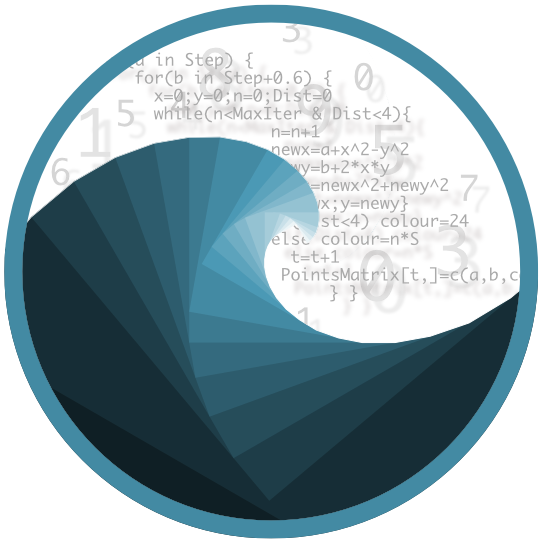
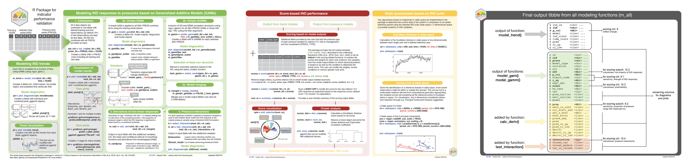
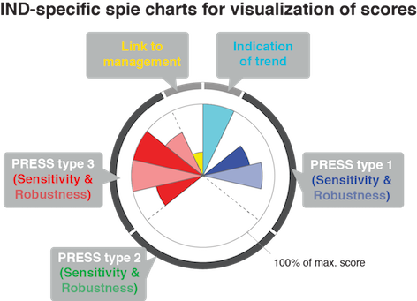

```{r, include = FALSE}
knitr::opts_chunk$set(
  collapse = TRUE,
  comment = "#>",
  fig.path = "README-"
)
options(tibble.print_min = 5, tibble.print_max = 5)
```
# INDperform 

<!-- badges: start -->
[](https://github.com/saskiaotto/INDperform/actions/workflows/check-full.yaml)
[](https://CRAN.R-project.org/package=INDperform)
[](https://cran.r-project.org/package=INDperform)
<!-- badges: end -->

INDperform is an R package for validating the performance of ecological state indicators and assessing the ecological status based on a suite of indicators.

Finding suitable state indicators (IND) is challenging and cumbersome in stochastic and complex ecological systems. Particularly, features associated with the indicator's performance such as sensitivity or robustness are often neglected due to the lack of quantitative validation tools. INDperform implements a novel quantitative framework for selecting and validating the performance of state indicators tailored to meet regional conditions and specific management needs as described in Otto *et al.* (2018). The package builds upon the tidy data principles and offers functions to

*	identify temporal indicator changes,
*	model relationships to pressures while taking non-linear responses and temporal autocorrelation into account, and to
*	quantify the robustness of these models.

These functions can be executed on any number of indicators and pressures. Based on these analyses and a scoring scheme for selected criteria the individual performances can be quantified, visualized, and compared. The combination of tools provided in this package can help making state indicators operational under given management schemes such as the EU Marine Strategy Framework Directive.

<br>

<a href="https://marinedatascience.co"> </a>

___INDperform is maintained and mainly developed by [Saskia Otto](https://saskiaotto.de),
[Institute of Marine Ecosystem and Fisheries Science](https://www.biologie.uni-hamburg.de/en/einrichtungen/imf.html) (IMF), University of Hamburg, Germany___

____________________________________________________________________________________

## <i class="fa fa-newspaper-o" aria-hidden="true"></i> Latest News 

In Version 0.2.2 some adjustments were made to account for changes in packages INDperform depends on and a minor bug fixed in the NRMSE model prediction plot. Some of the plotting functions include now also titles in the individual panels. A data validation routine was added to check for unwanted characters in indicator or pressure names which caused models to not build. For more details see the [NEWS]( https://saskiaotto.github.io/INDperform/news/index.html) file.

---

In Version 0.2.1, a minor bug with different internal test results under different R versions was fixed by modifying some tests. But this bug did not affect the modelling results or performance of the previous version.

---

Version 0.2.0 has been released on CRAN 2019-02-10! The new version includes a few internal changes as adjustments to updated packages it depends on. Major changes include a new NRMSE calculation based on the standard deviation and back-transformation (see [https://www.marinedatascience.co/blog/2019/01/07/normalizing-the-rmse/](https://www.marinedatascience.co/blog/2019/01/07/normalizing-the-rmse/) for the motivation), an NRMSE stand-alone function (`nrmse()`) and a function that allows the calculation of the distance matrix averaged across groups (i.e. a weighted distance matrix) (`dist_sc_group()`).
For more information see the [news](https://github.com/saskiaotto/INDperform/blob/master/NEWS.md) file.

____________________________________________________________________________________

## Cheat sheet

*(last update 01/2020)*

<a href="https://github.com/saskiaotto/cheatsheets/raw/master/Cheatsheet_INDperform_v0.2.2.pdf"></a>  
____________________________________________________________________________________

## <i class="fas fa-running" aria-hidden="true"></i> Getting started

Install the development version from GitHub using 'remotes':

```{r, eval = FALSE}
# install.packages("remotes")
remotes::install_github("saskiaotto/INDperform")
```

INDperform offers function that can be applied individually to some extent but mostly build upon each other to follow the 7-step process proposed in Otto *et al.* (2018) (see also the package's cheatsheet for detailed instructions). For demonstration purposes the package provides a dataset of food web indicators and pressure variables in the Central Baltic Sea (modified from Otto *et al.*, 2018).

This is a suggested workflow demonstrated on the example data included in the package:

## Workflow

```{r, eval = FALSE}
library(INDperform)
library(tidyverse)
library(gridExtra)

# Using the demo data
head(ind_ex)
head(press_ex)
head(press_type_ex)
# Scoring template:
crit_scores_tmpl
```

### A. Trend modeling

```{r, eval = FALSE}
m_trend <- model_trend(ind_tbl = ind_ex[ ,-1],
  time = ind_ex$Year)

# Model diagnostics
pd <- plot_diagnostics(model_list = m_trend$model)
pd$all_plots[[1]] # first indicator
# check for outliers in all models
grid.arrange(grobs = pd$cooks_dist, ncol = 3) 
# check normality in all models
grid.arrange(grobs = pd$qq_plot, ncol = 3)
# check homogeneity in all models
grid.arrange(grobs = pd$resid_plot, ncol = 3)
# check for autocorrelation in all models
grid.arrange(grobs = pd$acf_plot, ncol = 3)
# check for partial autocorrelation in all models
grid.arrange(grobs = pd$pacf_plot, ncol = 3)

# Save diagnostic plots per indicator in a pdf
ml <- marrangeGrob(grobs = pd$all_plots, ncol = 1, nrow = 1)
ggsave("Trend_diagnostics.pdf", ml, height = 8, width = 12)

# Inspect trends
pt <- plot_trend(m_trend)
pt$TZA # shows trend of TZA indicator
# show all together
ml <- grid.arrange(grobs = pt, ncol = 3)
ml
# save as pdf
ggsave("Trend_plots.pdf", ml, height = 12, width = 15)
# show only significant trends
grid.arrange(
  grobs = pt[which(m_trend$p_val <= 0.05)],
  ncol = 2
	)
```

### B. Indicator response modeling 

#### B.1 Initialize data 
Combine IND with pressures and select training and test period --> default is training data = first 90% of obs)
```{r, eval = FALSE}
dat_init <- ind_init(ind_tbl = ind_ex[ ,-1],
  press_tbl = press_ex[ ,-1], time = ind_ex$Year,
	train = 0.9, random = FALSE)
````

#### B.2a Model responses using simple GAMs (using default settings here)
```{r, eval = FALSE}
m_gam <- model_gam(init_tbl = dat_init, k = 5,
	family = stats::gaussian(), excl_outlier = NULL)

# Model diagnostics
pd <- plot_diagnostics(model_list = m_gam$model)  # (might take a while)
ml <- marrangeGrob(grobs = pd$all_plots, ncol = 1, nrow = 1)
ggsave("GAM_diagnostics.pdf", ml, height = 8, width = 12)

# Any outlier?
m_gam$pres_outlier %>% purrr::compact(.)
# - get number of models with outliers detected
purrr::map_lgl(m_gam$pres_outlier, ~!is.null(.)) %>% sum()
# - which models and what observations?
m_gam %>%
	dplyr::select(id, ind, press, pres_outlier) %>%
	dplyr::filter(!purrr::map_lgl(m_gam$pres_outlier, .f = is.null)) %>%
	tidyr::unnest(pres_outlier)

# Exclude outlier in models (using the returned model output tibble as selector)
m_gam <- model_gam(init_tbl = dat_init, excl_outlier = m_gam$pres_outlier)

# Any temporal autocorrelation (TAC)
sum(m_gam$tac)
# - which models
m_gam %>%
	dplyr::select(id, ind, press, tac) %>%
	dplyr::filter(tac)
```


#### B.2b Model responses using simple GAMMs if TAC is present 
(using same default settings here as for GAM, but not exclude observations yet)
```{r, eval = FALSE}
m_gamm <- model_gamm(init_tbl = dat_init,
  filter = m_gam$tac) # (apply GAMM only to rows where TAC detected)

# Again, any outlier?
purrr::map_lgl(m_gamm$pres_outlier, ~!is.null(.)) %>% sum()

# Select best GAMM from different correlation structures
# (based on AIC)
best_gamm <- select_model(gam_tbl = m_gam, gamm_tbl = m_gamm)
View(best_gamm)

# Still any temporal autocorrelation?
sum(best_gamm$tac) 
# - which models
best_gamm %>%
  dplyr::select(id, ind, press, tac, corrstruc) %>%
  dplyr::filter(tac) %>%
  print(n = 100)

# Inspect diagnostic plots of best GAMMs
pd <- plot_diagnostics(model_list = best_gamm$model)
ml <- marrangeGrob(grobs = pd$all_plots, ncol = 1, nrow = 1)
ggsave("bestGAMM_diagnostics.pdf", ml, height = 8, width = 12)
```

#### B.2c Merge GAM and GAMMs
```{r, eval = FALSE}
m_merged <- merge_models(m_gam[m_gam$tac == FALSE, ], best_gamm)

# View sign. models
filter(m_merged, p_val <= 0.05) %>%
  View() 
```

##### NRMSE adjustments on transformed INDs 
To allow a comparison of the model performance across transformed and untransformed indicators using the Normalized Root Mean Square error (NRMSE), the NRMSE has to be calculated on the original scale. The function `nrmse()` (applied to a single model) or the wrapper function `calc_nrmse()` (applied to a list of models) take as argument the transformation type that was applied to each indicator prior to the analysis and compute the NRMSE on the back-transformed observations and predictions (see also [https://marinedatascience.co/blog/2019/01/07/normalizing-the-rmse/](https://marinedatascience.co/blog/2019/01/07/normalizing-the-rmse/)).

In the example dataset `ind_ex` all indicators except for `MS` and `rZPPP` have been ln-transformed. So let's calculated a corrected NRMSE for these INDs using the wrapper function `calc_nrmse()`. To get the respective ids in the model output tibble for selection and replacement, we will use the helper function `find_id()` (the function returns a subset of the model tibble and the `id` column can be then used as index).
```{r, eval = FALSE}
sel <- find_id(
	mod_tbl = m_merged, 
	ind_name = c("TZA","rCC","Cops", "Micro", "Sprat",
		"Herring", "Stickle", "Cod", "SPF", "LPF")
)$id

m_merged$nrmse[sel] <- calc_nrmse(
	press = dat_init$press_test[sel], 
	ind = dat_init$ind_test[sel],
	model = m_merged$model[sel], 
	transformation = "log"
)
```

#### B.3 Calculate derivatives of (significant) non-linear responses
```{r, eval = FALSE}
m_calc <- calc_deriv(init_tbl = dat_init, mod_tbl = m_merged,
	sign_level = 0.05)
```

#### B.4 Test for pressure interactions (in significant models only=default)
```{r, eval = FALSE}
it <- select_interaction(mod_tbl = m_calc)
# (creates combinations to test for)

m_all <- test_interaction(init_tbl = dat_init, mod_tbl = m_calc,
	 interactions = it, sign_level = 0.05)

# Inspect diagnostics of threshold models
pd_thresh <- m_all$thresh_models %>%
	# flatten structure of nested threshold GAMs 
	flatten() %>%
	# and remove empty lists (where no threshold GAMs were applied (=NULL) 
	# or no threshold GAMs were better than the simple GAMs (=NA)
	keep(~is.list(.x))  %>%
	plot_diagnostics()

ml <- marrangeGrob(grobs = pd_thresh$all_plots, ncol = 1, nrow = 1)
ggsave("thresholdGAM_diagnostics.pdf", ml, height = 8, width = 10)

# Look at the development of the generalized cross-validation value 
# at different thresholds level: the plot should show that the GCVV
# of the final threshold should be clearly lower than of others 
# (you should see a single sharp trough, not at the edge)
grid.arrange(grobs = pd_thresh$gcvv_plot, ncol = 3)
# -> some models do NOT show this (e.g. #4,6,7): here we could set the
#  $interaction from TRUE to FALSE (for the scoring later) to ignore
# this potentially spurious interaction found:
m_all <- m_all %>% mutate(
	interaction = case_when(
	(ind ==	"Micro" & press == "Fsprat") |
		(ind ==	"Cod" & press == "Fher") | 
		(ind ==	"Cod" & press == "Fcod") ~ FALSE,
	TRUE ~ interaction))


# Show final significant GAM/GAMM (threshold GAM) plots:
sel <- which(m_all$p_val <= 0.05)
pm <- plot_model(init_tbl = dat_init[sel, ], mod_tbl = m_all[sel, ])
# Save all sign. indicator plots
ml <- gridExtra::marrangeGrob(grobs = pm$all_plots, ncol = 1, nrow = 1)
ggplot2::ggsave("Final_model_results.pdf", ml, height = 10, width = 12)
```


### C. Scoring based on model output

```{r, eval = FALSE}
scores <- scoring(trend_tbl = m_trend, mod_tbl = m_all, 
	press_type = press_type_ex)

# Runs a shiny app to modify the score for the subcriterion 10.1:
scores <- expect_resp(mod_tbl = m_all, scores_tbl = scores)

# Generate an easy to read summary from the nested scoring tibble
sum_sc <- summary_sc(scores)
sum_sc
```

#### Visualize scores with a spie chart (using the summary object as input)
```{r, eval = FALSE}
spie <- plot_spiechart(sum_sc,
	lab_size = 4, title_size = 4)
spie$TZA # shows the spiechart of the indicator TZA
# show all:
grid.arrange(grobs = spie, ncol = 3)
```

#### Cluster analysis based on scores to identify redundancies/complementarities
```{r, eval = FALSE}
scores_dist <- dist_sc(sum_sc$scores_matrix)
scores_clust <- clust_sc(scores_dist)
plot_clust_sc(scores_clust)

# Weighted cluster analysis where distance matrix is averaged across group scores
# (see ?dist_sc_group for more infos)
sc_mat <- sum_sc$scores_matrix
x <- list(
	sc_mat[,1:2], # crit 8 and 11
	sc_mat[,3:8], # crit 9 and 10 - fisheries
	sc_mat[,9:12], # crit 9 and 10 - nutrients
	sc_mat[,13:16] # crit 9 and 10 - climate
	) 
scores_w_dist <- dist_sc_group(x)
scores_w_clust <- clust_sc(scores_w_dist)
plot_clust_sc(scores_w_clust)
```


### D. State assessment based on final suite of IND

```{r, eval = FALSE}
# Select subset of complementary indicators and exclude any NAs, e.g.
ind_noNA <- drop_na(ind_ex)
ind_sub <- ind_noNA[ , c(2,3,4,12,13)]
```

#### D.1 Euclidean distance in state space
```{r, eval = FALSE}
ed <- statespace_ed(x = ind_sub, time = ind_noNA$Year, ref_time = ind_noNA$Year[1] )
plot_statespace_ed(ed) 
````

#### D.2 Convex hull of state space between 2 indicators 
( or between 2 variables from a multivariate analysis)
```{r, eval = FALSE}
ch <- statespace_ch(x = ind_sub$SPF, y = ind_sub$LPF, time = ind_noNA$Year,
	period_ref = 1984:1986, period_current = 2004:2008)

plot_statespace_ch(ch) + 
	ggplot2::xlab("Small Predatory Fish") + 
	ggplot2::ylab("Large Predatory Fish")
```

***
##### NOTE FOR SPATIAL DATA:

All functions are tailored to indicator time series. **Spatial data** and spatial autocorrelation testing is currently not included. However, if you have spatial data you could still use all functions except for `model_gamm()` as it incorporates only temporal autocorrelation structures (AR and ARMA). Simply do the following and use as `time` vector in `ind_init()` an integer variable with **consecutive** numbers (with no gaps!) representing your different stations.

```{r, eval = FALSE}
### Use of station numbers instead of time vector
station_id <- 1:nrow(your_indicator_dfr) 
dat_init <- ind_init(ind_tbl = your_indicator_dfr,
  press_tbl = your_pressure_dfr, time = station_id)
```

***

## <i class="fas fa-info" aria-hidden="true"></i> Details

### Validation of IND performances

#### Modeling IND trends and responses to single pressures

Each IND is modeled as a function of time or a single pressure variable using Generalized Additive Models (GAMs) (based on the mgcv package).

* `model_trend()` models the long-term trend of each IND and returns a tibble with all GAM outputs, the model object, and predicted time series per IND.
* `ind_init()` combines the time vector and the IND and press data into one tibble with defined training and test observations. All INDs are combined with all pressures.
* `model_gam()` applies GAMs to each IND~pressure combination created in `ind_init()` and returns a tibble including the model output and diagnostics.
* `model_gamm()` accounts for temporal autocorrelation in the time series by including correlation structures in the model (using Generalized Additive Mixed Models (GAMMs): AR1, AR2, ARMA1.1, ARMA2.1, ARMA1.2.
* `select_model()` selects for each IND~pressure the best correlation structure computed with `model_gamm()` based on the Akaike Information Criterion.
* `merge_models()` merges any 2 model output tibbles.
* `calc_deriv()` calculates for non-linear responses the 1st derivative of the smoothing function and the proportion of pressure range in which the IND shows a response. Output is input tibble with few additional variables, incl. mean and confidence interval of smoothing function and derivatives from bootstrapped GAMs.
* `test_interaction()` tests for each significant GAM(M) whether a selection of pressure variables modifies the IND response to the original pressure using a threshold-GAM formulation. Output is input tibble with few additional variables.

To show the model diagnostics or complete model results

* `plot_diagnostics()` creates a tibble with 6 individual plots (ggplot2 objects) and one combined plot (cowplot object):
	+ `$cooks_dist` shows the cooks distance of all observations.
	+ `$acf_plot` shows the autocorrelation function.
	+ `$pacf_plot` shows the partial autocorrelation function.
	+ `$resid_plot` shows residuals vs. fitted values.
	+ `$qq_plot` shows the quantile-quantile plot for normality.
	+ `$gcvv_plot` shows the development of the generalized cross-validation value at different thresholds level of the modifying pressure variable in the threshold-GAM.
	+ `$all_plots` shows all five (six if threshold-GAM) plots together.
* `plot_trend()` creates a list of ggplot2 objects with all IND trends from the input tibble.
* `plot_model()` creates a tibble with 4 individual plots (ggplot2 objects) and one combined plot (cowplot object):
	+ `$response_plot` shows the observed and predicted IND response to the single pressure (based on the training data).
	+ `$predict_plot` shows the test (and train) observations predicted from the model. Included is the normalized root mean square error (NRMSE) for the test data as a measure of model robustness.
	+ `$deriv_plot` shows the first derivative of non-linear IND~pressure response curves and the proportion of the pressure range where the IND shows no further significant change (i.e., slope approximates zero).
	+ `$thresh_plot` shows the IND response curve under a low and high regime of an interacting 2nd pressure variable.
	+ `$all_plots` shows all plots together.


#### Scoring IND performance based on model output

Among the 16 common indicator selection criteria, five criteria relate to the indicator's performances and require time series for their evaluation, i.e.

8. Development reflects ecosystem change caused by variation in manageable pressure(s)
9. Sensitive or responsive to pressures
10. Robust, i.e. responses in a predictive fashion, and statistically sound
11. Links to management measures (responsiveness and specificity)
12. Relates where appropriate to other indicators but is not redundant

As these are subject to the quality of the underlying data, a thorough determination of whether the indicator as implemented meets the expected requirements is needed. In this package, the scoring scheme for these criteria as proposed by Otto *et al.* (2018) serves as basis for the quantification of the IND performance. Sensitivity (criterion 9) and robustness (criterion 10) are specified into more detailed sub-criteria to allow for quantification based on statistical models and rated individually for every potential pressure that might affect the IND directly or indirectly.

However, the scoring scheme can easily be adapted to any kind of state indicator and management scheme by modifying the scores, the weighting of scores or by removing (sub)criteria.


```{r, eval = FALSE}
crit_scores_tmpl
```
This table contains the scores and weights for each (sub-)criterion. It includes also the variables from the model output tibbles on which each(sub)criterion is based on as well as the condition to determine the actual score. `crit_scores_tmpl` is set as default in the `scoring()` function and, if needed, should be modified prior to using the function.

* `scoring()` models the long-term trend of each IND and returns a tibble with all GAM outputs, the model object, and predicted time series per IND.
* `expect_resp()` runs a shiny app to modify manually the score for the sub-criterion 10.1 (IND response as expected) based on the response curves (default score 1 for neutral / no expectation).

<p align="center">
  
</p><br>


* `summary_sc()` provides a user-friendly summary of the scoring output tibble.
* `plot_spiechart()` generates a list of ggplot2 objects (one for each IND). A spie chart superimposes a normal pie chart with a modified polar area chart to permit the comparison of two sets of related data.

<p align="center">
  
</p><br>


**Examining redundancies and selecting robust indicator suites**

* `dist_sc()` Calculates a (Euclidean) distance matrix based on all scores.
* `clust_sc()` applies a hierarchical group-average cluster analysis, returns a `hclust` object and prints the Gower distance and Cophonetic correlation coefficient.
* `plot_clust_sc()` creates a dendrogram (ggplot2 object) from the cluster analysis.


### Assessment of current state status
Two approaches based on trajectories in state space to determine the current state of the system in comparison to an earlier period as reference using the selected IND suite (state space = n-dimensional space of possible locations of IND variables)


1. Calculation of the **Euclidean distance** in state space of any dimensionality between each single year (or any other time step used) and a defined reference year.

    + `statespace_ed()` calculates the Euclidean distance over time.
    + `plot_statespace_ed()` creates a ggplot2 object of the Euclidean distance trend.

2. Given the identification of a reference domain in state space, more recent observations might lie within or outside this domain. The **convex hull** is a multivariate measure derived from computational geometry representing the smallest convex set containing all the reference points in Euclidean plane or space. For visualization, only 2 dimensions considered (dimension reduction through e.g. Principal Component Analysis suggested).

    + `statespace_ch()` calculates the convex hull for 2 defined periods (current and reference) in the x-y space (i.e. 2 IND or 2 Principal Components).
    + `plot_statespace_ch()` creates a ggplot2 object showing all observed combinations in x-y space as well as the convex hull of both periods. The proportion of the recent time period within the reference space is additionally provided.
